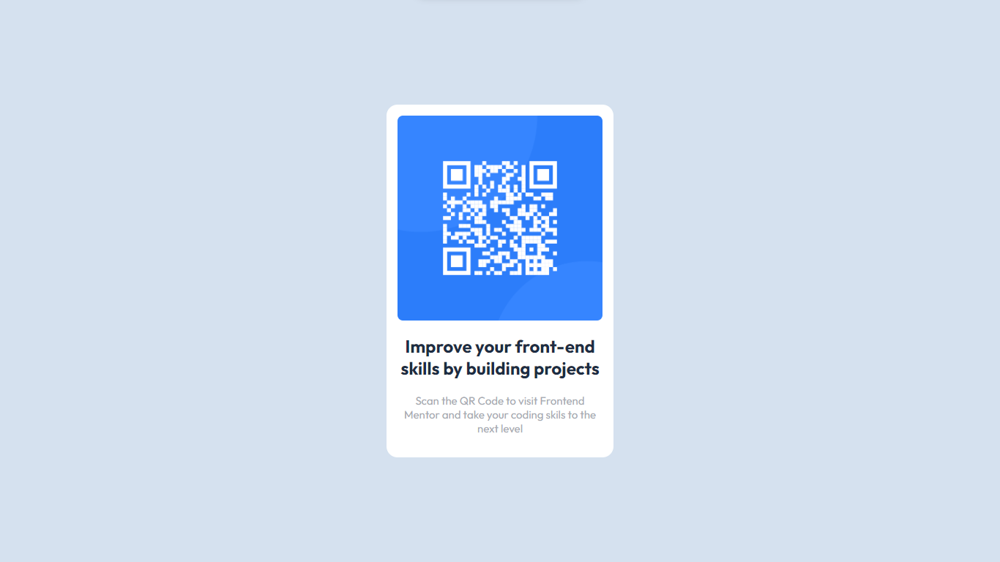

# Frontend Mentor - QR code component solution

This is a solution to the [QR code component challenge on Frontend Mentor](https://www.frontendmentor.io/challenges/qr-code-component-iux_sIO_H). Frontend Mentor challenges help you improve your coding skills by building realistic projects.

## Table of contents

- [Overview](#overview)
  - [Screenshot](#screenshot)
- [My process](#my-process)
  - [Built with](#built-with)
  - [What I learned](#what-i-learned)
- [Author](#author)

## Overview

- This is a simple URL Component Container that links to Frontend Mentor.

### Screenshot



### Links

- Solution URL: [Add solution URL here](https://github.com/Thotholani/URL)
- Live Site URL: [Add live site URL here](https://thotholani.github.io/URL/)

## My process

- Make basic html site using html tags
- Create and link style.css folder to html
- Style html using css

### Built with

- Semantic HTML5 markup
- CSS custom properties
- Flexbox
- Mobile-first workflow

### What I learned

I learned how to easily vertically center an element using flexbox. This can be done by assigning a height to the element, giving it a display of flex and finally by using align-items: center to move the element to the center of the page relative to the assigned height.

```html
<section class="url"></section>
```

```css
.url {
    min-height: 100vh;
    display: flex;
    align-items: center;
}
}
```

## Author

- Instagram - [@ttembo]
- Frontend Mentor - [@Thotholani](https://www.frontendmentor.io/profile/Thotholani)
